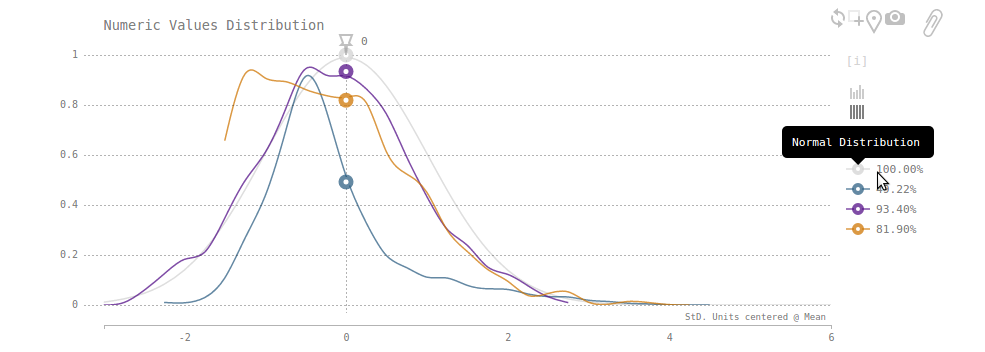
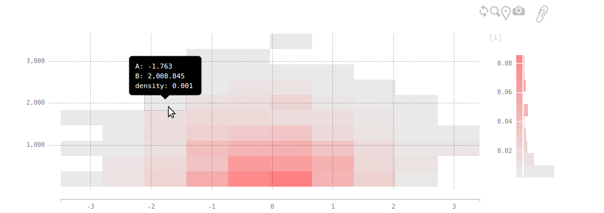
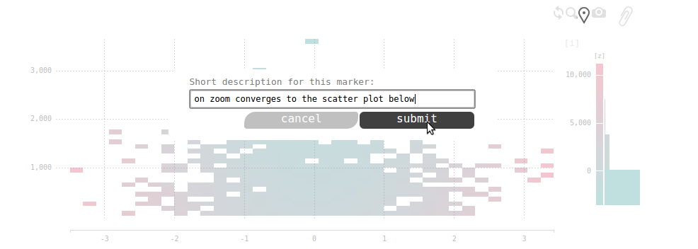
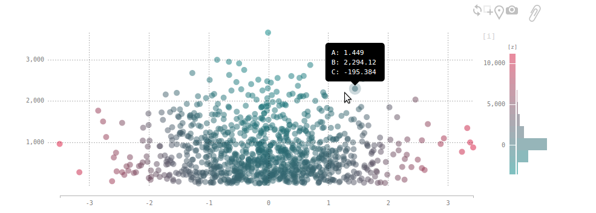
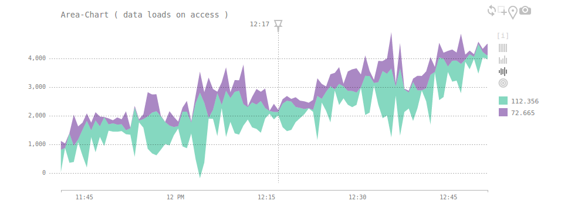
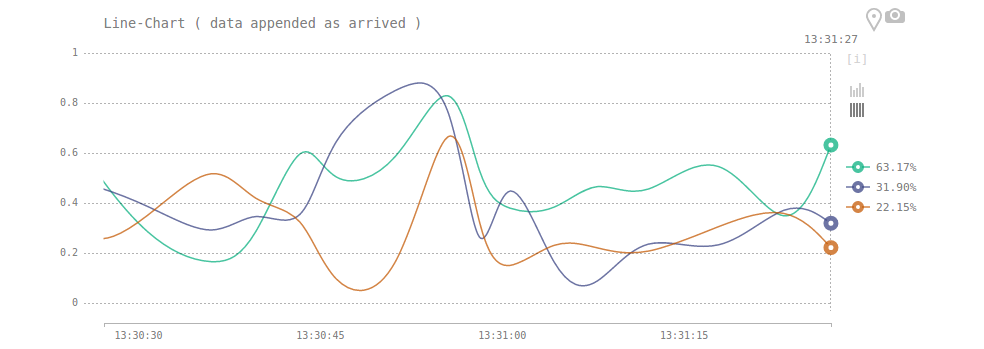

# Interactive Visualization ( D3 ) in Jupyter Notebook

This project is integrated with <a href="https://github.com/arcta/server-setup">Data-Science R&amp;D on Ubuntu</a> and comes as a part of a server setup. Main focus on the data exploration process itself; identifying scenarios where interactivity has actual advantage for finding insights. Main objective is support for interactive visuals embedded in the notebook with ability to save insights as deep-links.

While in development contents are stored in redis; when the notebook published all included visuals compiled and stored in redis, file-system, s3/gc bucket, memcache, etc.

Supported data sources:
* static ( json )
* dynamic ( url end-point )
* stream ( pubsub channel )

Dynamic & stream are intended for monitoring and saving static (data) snapshots for insights.

Install with `pip istall -e .` from the repository folder.

```python
# use local file system to store compiled visuals
from viz import local
viz = local.VizNotebook('http://192.168.1.145:4006')
```


```python
import numpy
import pandas
from datetime import datetime 
from time import time

# generate some data
df = pandas.DataFrame(numpy.random.randn(1000, 3), columns=list('ABC'))
df['B'] = df['B'].apply(lambda b: 1 + 1000*abs(b))
df['C'] = df['A'].apply(lambda a: 1000*a*a) - df['B']
df.head()
```


<div>
<table border="1" class="dataframe">
  <thead>
    <tr style="text-align: right;">
      <th></th>
      <th>A</th>
      <th>B</th>
      <th>C</th>
    </tr>
  </thead>
  <tbody>
    <tr>
      <th>0</th>
      <td>-0.833246</td>
      <td>1029.844394</td>
      <td>-335.545168</td>
    </tr>
    <tr>
      <th>1</th>
      <td>-0.356108</td>
      <td>951.381885</td>
      <td>-824.569239</td>
    </tr>
    <tr>
      <th>2</th>
      <td>-1.034593</td>
      <td>94.172688</td>
      <td>976.210082</td>
    </tr>
    <tr>
      <th>3</th>
      <td>0.997263</td>
      <td>895.231576</td>
      <td>99.302540</td>
    </tr>
    <tr>
      <th>4</th>
      <td>0.942769</td>
      <td>631.027046</td>
      <td>257.785693</td>
    </tr>
  </tbody>
</table>
</div>


```python
df.describe()
```


<div>
<table border="1" class="dataframe">
  <thead>
    <tr style="text-align: right;">
      <th></th>
      <th>A</th>
      <th>B</th>
      <th>C</th>
    </tr>
  </thead>
  <tbody>
    <tr>
      <th>count</th>
      <td>1000.000000</td>
      <td>1000.000000</td>
      <td>1000.000000</td>
    </tr>
    <tr>
      <th>mean</th>
      <td>-0.030021</td>
      <td>776.089950</td>
      <td>150.772361</td>
    </tr>
    <tr>
      <th>std</th>
      <td>0.962750</td>
      <td>590.647277</td>
      <td>1381.836851</td>
    </tr>
    <tr>
      <th>min</th>
      <td>-2.770263</td>
      <td>1.743588</td>
      <td>-2832.821084</td>
    </tr>
    <tr>
      <th>25%</th>
      <td>-0.650372</td>
      <td>295.202289</td>
      <td>-661.785333</td>
    </tr>
    <tr>
      <th>50%</th>
      <td>-0.012500</td>
      <td>663.869570</td>
      <td>-108.894884</td>
    </tr>
    <tr>
      <th>75%</th>
      <td>0.683101</td>
      <td>1128.901757</td>
      <td>581.122473</td>
    </tr>
    <tr>
      <th>max</th>
      <td>3.343914</td>
      <td>3453.553158</td>
      <td>10707.914381</td>
    </tr>
  </tbody>
</table>
</div>


```python
import json

# data format: dictionary per observation
data = df.to_json(orient='records')
print(json.loads(data)[0])
```

    {'B': 1029.8443937679, 'C': -335.5451675297, 'A': -0.8332461979}


```python
viz.summary(data, height=350)
```




```python
viz.static(data, type='matrix', height=350, width='95%',
           x='A',
           y='B',
           colormap=['lightgray','red'])
```




```python
viz.static(data, type='matrix', height=350, width='95%',
           x='A',
           y='B',
           z='C',
           colormap=['teal','crimson'],
           zbins=4)
```




```python
viz.static(data, type='scatter', height=350, width='95%',
           x='A',
           y='B',
           z='C',
           colormap=['teal','crimson'])
```




```python
# dynamic data source
df = pandas.read_json('http://192.168.1.145:4004/sample/100')
df.head()
```


<div>
<table border="1" class="dataframe">
  <thead>
    <tr style="text-align: right;">
      <th></th>
      <th>A</th>
      <th>B</th>
      <th>C</th>
      <th>D</th>
      <th>E</th>
    </tr>
  </thead>
  <tbody>
    <tr>
      <th>0</th>
      <td>0.395556</td>
      <td>1611.004572</td>
      <td>red</td>
      <td>2017-01-08 14:30:17</td>
      <td>-1454.540113</td>
    </tr>
    <tr>
      <th>1</th>
      <td>-0.321907</td>
      <td>1907.167224</td>
      <td>red</td>
      <td>2017-01-08 14:29:34</td>
      <td>-1803.543089</td>
    </tr>
    <tr>
      <th>2</th>
      <td>-1.307113</td>
      <td>1597.402216</td>
      <td>yellow</td>
      <td>2017-01-08 14:28:51</td>
      <td>111.143370</td>
    </tr>
    <tr>
      <th>3</th>
      <td>-1.114821</td>
      <td>185.095331</td>
      <td>yellow</td>
      <td>2017-01-08 14:28:08</td>
      <td>1057.730000</td>
    </tr>
    <tr>
      <th>4</th>
      <td>1.448177</td>
      <td>1123.029106</td>
      <td>red</td>
      <td>2017-01-08 14:27:25</td>
      <td>974.188253</td>
    </tr>
  </tbody>
</table>
</div>


```python
# loads current data on access
viz.dynamic('http://192.168.1.145:4004/sample/100', type='area', height=350, width='100%',
            x='D',
            y=['B','F'],
            mode='wiggle',
            title='Area-Chart ( data loads on access )')
```




```python
# use redis pubsub to stream data
from viz import pubsub
viz = pubsub.VizNotebook('http://192.168.1.145:4006')
```


```python
# listens to pubsub messages channel `sample-io`
viz.stream('http://192.168.1.107:4017/sample-io', type='line', height=350, width='100%',
            x='D',
            y=['A','B','E'],
            title='Line-Chart ( data appended as arrived )',
            interpolate='Basis',
            mode='normalized',
            xformat='%H:%M:%S')
```



With non-static data Marker tool creates static data snapshots.

More examples @ <a href="http://www.arcta.me/projects/viz/">Project-Home</a>:
* <a href="http://www.arcta.me/projects/viz/examples/matrix/index.html">Matrix</a>
* <a href="http://www.arcta.me/projects/viz/examples/scatter/index.html">Scatter</a>
* <a href="http://www.arcta.me/projects/viz/examples/line/index.html">Timeseries</a>
* <a href="http://www.arcta.me/projects/viz/examples/area/index.html">Area</a>


```python
# compile static resources and save in destination
viz.publish(path_publish='projects/viz/app/static', path_notebook='projects/viz/README')
```

#### Run in Docker Container 

To run viz-server in a docker container:
<pre>
cd app
docker run --name latest -d redis
docker build -t node .
docker run -d --name node -P --link latest:redis node
docker ps -a # grab the reference

CONTAINER ID        IMAGE             PORTS                     NAMES
c98a1501864a        node              0.0.0.0:32771->4000/tcp   node
092d5174a9a7        redis             6379/tcp                  latest
</pre>


```python
from viz import local
viz = local.VizNotebook('http://0.0.0.0:32771')
```
